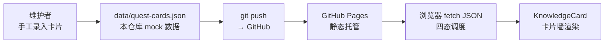

# TECH_DESIGN.md — 知识闯关 技术设计

> Day 8 一次性回填（沿用原项目 Day 5 练过的设计文档范式：一句话路线 + 方案对比 + 数据流正反两面 + 收尾对照表）。

## 1. 一句话技术路线

> 纯静态单页：原生 HTML/CSS/JS + 本地 JSON mock 数据 + GitHub Pages 托管，第 3 周再换真实 API。

## 2. 候选方案对比

| 方案 | 说明 | 优点 | 缺点 | 结论 |
|---|---|---|---|---|
| A. 纯静态 + 本地 JSON | 原生三件套，fetch 本地文件 | 零依赖、Pages 直发、聚焦前端基本功 | 无真实持久化 | ✅ 选定（第 2 周） |
| B. 静态页 + 云函数 API | 前端不变，后端用云函数 | 提前打通全栈 | 第 2 周分心后端，违背当天任务节奏 | 第 3 周再上 |
| C. 低代码/框架 | Vue/React + 平台托管 | 上手快 | 训练营要练底层，框架屏蔽了 fetch/状态这些学习点 | 淘汰 |

**核心理由**：本项目第 2 周的学习点是「主视图 + 四种页面状态 + mock 渲染 + 可复用组件」，方案 A 用最少的花销把这些全练到；数据结构按 API 形状设计（数组 + 字段），第 3 周换后端只改 `js/main.js` 里 `load()` 的 fetch 地址。

## 3. 组件化设计

- `js/components.js`：`KnowledgeCard.create(card, opts)` / `KnowledgeCard.renderGrid(el, cards, opts)`——组件不知道数据来源，只负责「一张卡片 → 一个 DOM」，点击翻面逻辑内聚在卡片里
- `js/main.js`：只管状态调度（四态互斥）、筛选、洗牌和数据加载；渲染全部委托组件

## 4. 数据流（正向）

读图一句话：卡片从「手工录入」出发，经仓库与 Pages，最终在浏览器里变成可筛选、可翻面的卡片墙；点击翻面等交互只发生在浏览器本地，不回写。

## 5. 数据不会去的地方（反向声明）

| 数据/信息 | 不会去的地方 | 说明 |
|---|---|---|
| 卡片内容 | ❌ 任何后端/数据库 | 第 2 周无后端，mock 数据随仓库走 |
| 翻面/筛选行为 | ❌ 任何统计上报 | 纯本地交互，无埋点 |
| 用户输入 | ❌ 不存在 | Day 8 无任何表单与输入框 |
| 访问者信息 | ❌ 不收集 | 无 cookie、无 localStorage、无第三方脚本 |

## 6. 方案变化影响表（第 3 周接 API 时）

| 环节 | 变化 | 要动的地方 |
|---|---|---|
| 数据来源 | 本地 JSON → API | `js/main.js` 的 `load()`（一处） |
| 卡片增删 | 无 → 表单/接口 | 新增页面 + API 模块，`components.js` 不动 |
| 四种状态 | 逻辑复用 | 仅错误态文案随接口调整 |

## Day 8 收尾对照表（逐项证据）

| 项 | 状态 | 证据 |
|---|---|---|
| 主任务：生成并运行主视图（mock 数据版） | ✅ | `index.html` + `js/*` + `data/quest-cards.json`，本地 8000 端口渲染 24 张卡片 |
| 板块① 一句话生成页面 | ✅ | research.md 第 5 节一句话；页面逐条落地（卡片墙/筛选/翻面/随机复习） |
| 板块② 本地运行 | ✅ | `python -m http.server 8000`，截图含地址栏 localhost:8000 |
| 板块③ mock 数据渲染 | ✅ | 卡片全部来自 `data/quest-cards.json`，页内显示「共 24 张卡片」 |
| 完成标准① 页面本地能打开 | ✅ | A1 验收通过，控制台无报错 |
| 完成标准② 列表和卡片用本地假数据渲染 | ✅ | A2 验收通过，渲染委托 `KnowledgeCard.renderGrid` |
| 完成标准③ 改动已提交 | ✅ | Day 8 提交（git log 可查），API 推送断言远端 main == 本地 HEAD |
| 今日不做：接真实 API | 🛡️ 守住了 | 唯一 fetch 指向本地 JSON |
| 今日不做：加登录 | 🛡️ 守住了 | 无登录/鉴权代码 |
| 卡住降级 | ➖ 未触发 | 四态与组件全部实现，未降级 |

## 12. Day 9：闯关模式雏形 + 卡片录入（本地持久化）

学员验收 Day 8 后指出两个核心缺口：「知识库存知识」没有录入入口、「闯关游戏」没有答题判定。当天补齐（纯前端，不动 mock 数据文件）。

### 12.1 新增功能

| 功能 | 实现 | 说明 |
|---|---|---|
| 闯关模式（F6 本地版） | `js/quiz.js` | 抽 5 关 → 看题自答 → 显示答案核对 → 自判「答对/没答上」→ 通关成绩单（得分/集章/逐题复盘） |
| 添加卡片（F11） | `index.html` 表单 + `js/store.js` | 科目（含自定义）+ 正面 + 背面；存 localStorage（key `kq_user_cards`），刷新不丢；自存卡带「自存」标和删除按钮 |
| 最佳战绩 | `js/store.js`（key `kq_best_score`） | 每轮成绩更好才刷新 |
| 双视图 | `js/main.js` showView | 卡片墙 ⇄ 闯关，`#quiz` hash 可直达 |

### 12.2 数据流变化（不新增后端）

新增一条**只属于本机浏览器**的数据支路：用户表单 → localStorage → 与 mock 卡片合并渲染/闯关。mock JSON 仍只读；两路数据不互相污染。localStorage 不随仓库走、不上传——换设备/清浏览器数据会丢自存卡，这是接 API 前的已知取舍（页脚已提示「自存卡片保存在本机浏览器」）。

### Day 9 收尾对照表（逐项证据）

| 项 | 状态 | 证据 |
|---|---|---|
| 学员反馈①：知识库没有录入入口 | ✅ 已解决 | 「＋ 添加卡片」表单，自存卡 localStorage 持久化（F11） |
| 学员反馈②：没有闯关模式，点卡直接出答案 | ✅ 已解决 | 闯关视图：先自答→翻面核对→自判→成绩单（F6 本地版） |
| 改动已提交推送 | ✅ | Day 9 提交，git 直推，远端 main == 本地 HEAD |
| 今日不做：接真实 API | 🛡️ 守住了 | 持久化用 localStorage，无后端 |
| 已知取舍 | 📌 记录 | 自存卡仅存本机浏览器；闯关为自判非客观判定，均待第 3 周 API 升级 |
